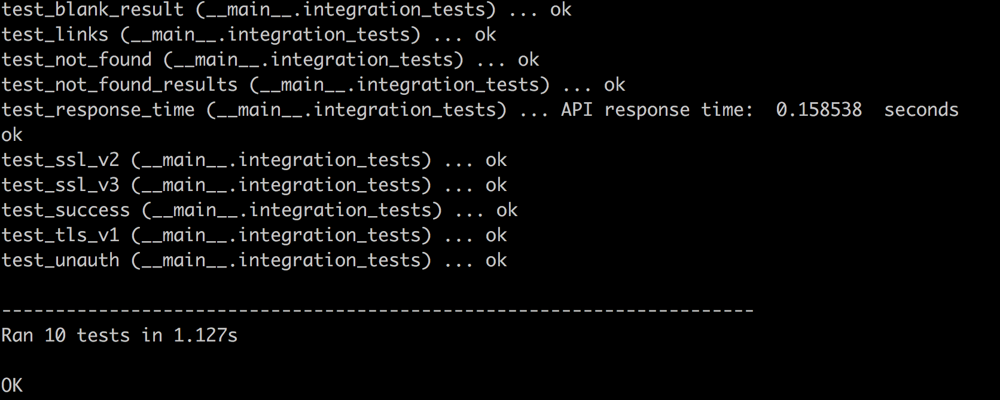

# Locations Frontend API Integration Tests

This directory contains files that run integration tests against the locations frontend API. To run the tests, use Python. These libraries are required to run the integration tests:

* [json](https://docs.python.org/2/library/json.html)
* [requests](http://docs.python-requests.org/en/master/)
* [unittest](https://docs.python.org/2/library/unittest.html)
* [ssl](https://pypi.python.org/pypi/ssl/)
* [urllib2](https://docs.python.org/2/library/urllib2.html)

Use this command to run the tests:

	python integrationtests.py -i /path/to/configuration.json

Any unittest command line arguments should be used before the -i argument. For example, this command will run the tests in verbose mode:

	python integrationtests.py -v -i /path/to/configuration.json

Successfully passing all the tests with the command above would output this result:



Python Version: 2.7.10

#### Docker

This directory contains files that run integration tests against the Locations Frontend API.

First, create a configuration.json file from configuration_example.json.

Next, use these commands to build and run the container. All you need installed is Docker.

```shell
$ docker build -t location-frontend-tests .
# Run the integration tests in *nix
$ docker run -v "$PWD"/configuration.json:/usr/src/app/configuration.json:ro location-frontend-tests
# Run the integration tests in Windows
$ docker run -v c:\path\to\configuration.json:/c:\usr\src\app\configuration.json:ro location-frontend-tests
```

Currently, there is one failure test which will return wrong error code for POST method:


